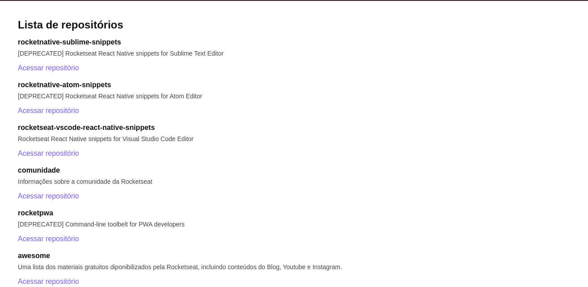

# Github Explorer

<p align="center">
  <a href="#-tecnologias">Tecnologias</a>&nbsp;&nbsp;&nbsp;|&nbsp;&nbsp;&nbsp;
  <a href="#-como-executar">Como executar</a>
</p> 

<p align="center">
  
</p>

## ⚙ Tecnologias

Esse projeto foi desenvolvido com as seguintes tecnologias:

- [React](https://www.reactjs.org)
- [Babel](https://babeljs.io)
- [Webpack](https://webpack.js.org)
- [Sass](https://sass-lang.com)
- [TypeScript](https://www.typescriptlang.org)


## 🚀 Como executar

- Clone o repositório
```
git clone https://github.com/BrunoBecoski/Ignite-ReactJS-01-github-explorer.git
```
- Instale as depêndencias
```
yarn install
```
- Inicie o servidor
``` 
yarn dev
```
- Acesse no seu navegador
```
http://localhost:8080
```
